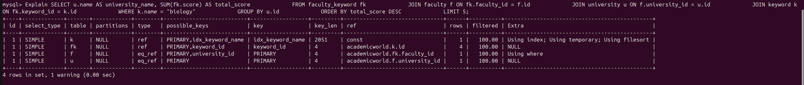

# Title: Discover Research Across Universities

## Purpose 
Our application is intended to be used by prospective graduate students to help find professors and universities with aligning research interests. It is meant to be a starting point and allow students to save favorites to do more research on later. Students can search keywords they are interested in and find relevant professors, universities and papers. They can also store favorite professors and universities in a list to do more looking later.

## Demo 
[Video Link](https://mediaspace.illinois.edu/media/t/1_rx64ym0l)

## Installation 
1. Make sure you have the 3 databases (mysql, mongo, neo4j) populated with the academicworld dataset
2. Configure appropriate environment variables in a `dash_app/.env` file to help with database authentication
3. `pip install -r requirements.txt` (we recommend doing this in a python .venv with python >= 3.9.6)
4. Run `python dash_app/app.py`

## Usage
To use the application, first enter a research keyword you related to your interests in the "Search by Keyword" field. Then you should get a list of top universities, professors, and publications along with citation trends corresponding to that keyword. Looking through these rankings/trends, you can add any professors or universities you like to a favorites list. You can then search the universities you like in the "Top Research Keywords at a University" field to get an understanding of university research output. You can use your favorites list to do more searching outside of our application.

## Design

## Architecture

We used `dash` as recommended in the project description. We have an `app.py` that describes app layout. db queries for each database are located in their respective `utils.py` file in the db/ folder.

### Components
1. Top universities widget (sql)
    - gets top universities relevant to a specified keyword
2. Top professors widget (sql)
    - gets top professors relevant to a specified keyword
3. Top publications widget (sql)
    - gets top publications relevant to a specified keyword
4. Add Favorite Widget (mongodb)
    - saves favorite professors, universities, or topics to mongodb
5. Remove Favorite Widget (mongodb)
    - removes specified favorite from favorite professors, universities or topics in mongodb. (note: favorites list is saved by session cookies)
6. Top Research Keywords at a University (neo4j)
    - displays top research keywords at a university
7. Citation Trends (neo4j)
    - displays citation trends for a given keyword

## Implementation 

## Frameworks
- dash & plotly
- dotenv
- pymongo
- neo4j
- mysql

## Tools
- python >= 3.9.6
- git

## Database Techniques
- Transactions
    - Our 3 SQL queries are done in one repeatable read transaction because they operate on the same keyword. This ensures that they use the same snapshot of the database.
- Indexing
    - When we load the python modules in `mysql_utils.py` we create indexes on non primary keys in the keywords table that are then used in our sql queries.
- Prepared Statements
    - Each of our 3 keyword SQL queries is a template that takes in a keyword parameter. We followed [this link](https://dev.mysql.com/doc/connector-python/en/connector-python-api-mysqlcursorprepared.html) to ensure those queries are executed as prepared statements.

## Technical Requirements Overview
r1 - r5 are non technical and relate mostly to setup and solving an interesting problem

r6 - 3 sql queries for top professors, universities and publications given a keyword

r7 - 2 mongo db queries for favorites list tracking

r8 - 1 neo4j query for top keywords given a university

r9 - 7 widgets as listed above

r10 - Both mongo widgets update the database

r11 - All of our widgets take user input

r12 - Our visual layout is informative and logical

r13 - Prepared Statement

r14 - Transaction

r15 - Indexing
    Because indexes are used automatically, we saved some output to help prove that we are actually using a non primary key index (idx_keyword_name) that we manually created. 

## Contributions
Akhil: Initial project structure, initial very basic styling and output, mongodb queries, sql queries, sql transactions, indexing and prepared statements, readme (~20 hours)

Pallavi: sql indexing, neo4j queries, complex formatting output and styling as per instructions, video recording & submission (~20 hours)